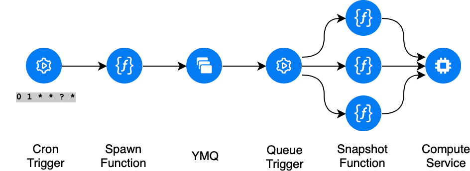
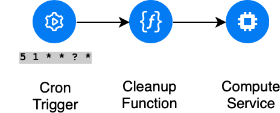

This is an ehanced fork of https://github.com/nikolaymatrosov/go-yc-serverless-snapshot

## Contents

- [Contents](#contents)
- [Roadmap](#roadmap)
- [Overview](#overview)
  - [Enhancements](#enhancements)
- [Deploy](#deploy)
  - [Function Variables](#function-variables)
    - [**spawn-snapshot-tasks**](#spawn-snapshot-tasks)
    - [**snapshot-disks**](#snapshot-disks)
- [### Disk labels](#-disk-labels)
  - [TTL precedence](#ttl-precedence)
  - [Terraform Deploy](#terraform-deploy)
  - [Manual Deploy](#manual-deploy)
    - [Linux (MacOs)](#linux-macos)
    - [Windows](#windows)
- [License](#license)

## Roadmap

- [ ] General:
  - [ ] Bump Golang version 1.14 => 1.16
  - [ ] Add Dependabot
- [x] Logic:
  - [x] 1. Rewrite snapshot label logic to check its boolean value (true\false)
  - [x] 2. Snapshot policy name logic
    - [x] Compare policy names
    - [x] Update policy name map
  - [x] 3. Specify TTL via disk label and ENV variables:
    - [x] Enhance JSON model (diskLabels, policyName, DefaultTTL, OverrideTTL)
    - [x] Add extra labels to disk snapshot
    - [x] Variables precedence and precedence logic
      - [x] Specify OVERRIDE_TTL.env to force TTL
      - [x] defaultTTL - 90000sec (1d 1h)
  - [ ] Logging:
    - [ ] Add Warning logs for snapshots exceeding concurrency limit (**snapshot-disks.go**)
    - [ ] Log FATAL if snapshot returns something else instead of timeout and delete message from queue (current queue message ttl is 86400 seconds - 1 day)
- [x] Docs:
  - [x] Specify input variables \w default values
- [x] Examples:
  - [x] Terraform code example to deploy
  - [x] Automate version update via Terraform

## Overview

Due to cloud limitations on maximum concurrently running snapshots (15 at a time) a message queue is leveraged.

1. First function **spawn-snapshot-tasks.go** iterates over disks, filters them for matching labels and adds appropriate disks to snapshot queue. The function has several settings, which are controlled via Environment variables (see ##variables section) and gets triggered by customizable cron.
2. **snapshot-discs.go** does actual snapshots. It gets triggered by new messages in message queue. If a snapshot failes with an error (i.e. concurrency rate limit exceeded), its message is returned back to queue.



3. **delete-expired.go** also gets triggered by cron and removes snapshots which ttl has expired. To do so it compares snapshots with label `expiration_ts` with current unix-timestamp.



### Enhancements

- Add EpochTimestamp to snapshot name

## Deploy

### Function Variables

#### **spawn-snapshot-tasks**

| Name                  | Description                                                                                                                                                                                                                                                                                                    | Type          | Default   |  Required  |
| --------------------- | -------------------------------------------------------------------------------------------------------------------------------------------------------------------------------------------------------------------------------------------------------------------------------------------------------------- | ------------- | --------- | :--------: |
| FOLDER_ID             | Folder ID to run function in                                                                                                                                                                                                                                                                                   | `string`      | n/a       |    yes     |
| QUEUE_URL             | Message Queue URL                                                                                                                                                                                                                                                                                              | `string`      | n/a       |    yes     |
| AWS_ACCESS_KEY_ID     | Generated S3 API complient credentials                                                                                                                                                                                                                                                                         | `string`      | n/a       |    yes     |
| AWS_SECRET_ACCESS_KEY | Generated S3 API complient credentials                                                                                                                                                                                                                                                                         | `string`      | n/a       |    yes     |
| ------                | -------------                                                                                                                                                                                                                                                                                                  | ------        | --------- | :--------: |
| LOG_LEVEL             | Log level of function. Use INFO to debug execution                                                                                                                                                                                                                                                             | `string`      | WARN      |     no     |
| MODE                  | This switch controls function behaviour. Use *only-marked* value to snapshot disks with *snapshot="true"* label. If left empty, all disks in FOLDER_ID will be snapshotted                                                                                                                                     | `string`      | n/a       |     no     |
| POLICY_NAME           | A policy name to filter disks. Only disks with corresping policy in *snapshot-policy* label will be snapshotted. **Hint**: use only lowercase literals\numbers and '-' (hyphen) symbol in policy name. If a policy name is omitted then all disks without (or with empty) *snapshot-policy* label are matched. | `string`      | n/a       |     no     |
| DEFAULT_TTL           | TTL to keep snapshot for (in sec). This TTL is used by default for all disks matching this functions *policy*. This TTL can be overriden via disks label *snapshot-ttl*                                                                                                                                        | `string`(sec) | 90000     |     no     |
| OVERRIDE_TTL          | TTL to keep snapshot for (in sec). This overrides both *DEFAULT_TTL* and *snapshot-ttl* disk label                                                                                                                                                                                                             | `string`(sec) | n/a       |     no     |


#### **snapshot-disks**

| Name      | Description                                        | Type     | Default | Required |
| --------- | -------------------------------------------------- | -------- | ------- | :------: |
| LOG_LEVEL | Log level of function. Use INFO to debug execution | `string` | WARN    |    no    |


### Disk labels
----

**Case 1** - default (empty) policy

```console
resource "yandex_compute_disk" "disk_no_policy" {
  name = "snapshot-test-1"
..
  labels = {
    snapshot = "true"
  }
}
```
Disk will get snapshotted if:
- MODE = only-marked
- POLICY_NAME = ""

----

**Case 2** - policy **daily**. Snapshot will get **default_ttl** from function

```console
resource "yandex_compute_disk" "disk_no_ttl" {
  name = "snapshot-test-2"
..

  labels = {
    snapshot        = "true"
    snapshot-policy = "daily"
  }
}
```
Disk will get snapshotted if:
- MODE = only-marked
- POLICY_NAME = "daily"

----

**Case 3** - policy **daily**, override **default_ttl** via disk label

```console
resource "yandex_compute_disk" "disk_self_ttl" {
  name = "snapshot-test-3"
..

  labels = {
    snapshot        = "true"
    snapshot-ttl    = "900"
    snapshot-policy = "daily"
  }
}
```
Disk will get snapshotted if:
- MODE = only-marked
- POLICY_NAME = "daily"

----
### TTL precedence

TTL is honored in this order (first match wins):

- **OVERRIDE_TTL** (function env)
- **snapshot-ttl** (disk label)
- **DEFAULT_TTL** (function env)


### Terraform Deploy

**Quick-start**:
- Fill files: **providers.tf**, **data.tf**
- Deploy snapshot policies via copying and changing **main-func-snapshot-policy-1.tf**
- `terraform plan && terraform apply`

### Manual Deploy

I strongly advise using Terraform to deploy, update and destroy the whole setup. It is also easy to label your disks w\ Terraform.

#### Linux (MacOs)

**Requirements**:
- [yc](https://cloud.yandex.ru/docs/cli/quickstart)
- [aws cli](https://cloud.yandex.ru/docs/storage/tools/aws-cli)
- [s3cmd](https://cloud.yandex.ru/docs/storage/tools/s3cmd) (DEPRECATED)

**Steps**:
1. Copy and fill out `./deprecated-script/.env` file from `./deprecated-script/.env.template`
2. `./deprecated-script/create.sh` will create 3 empty functions, 3 triggers and a message queue
3. `./deprecated-script/deploy.sh`

#### Windows

Ehhh, just switch to Linux. Or try to get along with WSL2

## License

MIT